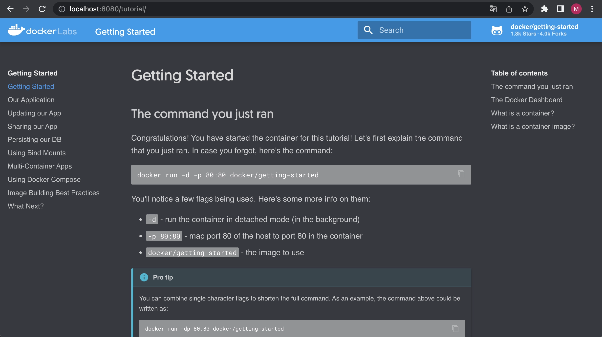

## Docker desktop is paid for commercial use

Almost all users would have used Docker to deploy containers.
Users who use Linux distributions (such as Ubuntu, CentOS, etc.) for their OS haven't had a problem.
But, on Windows or macOS, you can use Docker only over virtualization.
You can't use Docker natively on Windows or macOS.
To reduce the discomfort of users, the Docker desktop came up.
The Docker desktop creates a virtual machine to deploy containers via [LinuxKit](https://github.com/linuxkit/linuxkit).
However, the Docker desktop was converted to be paid for commercial use.
From 2022/01/31, Docker desktop users have to pay for commercial purposes. 
The changes are a burden for users who previously got the Docker desktop for free.
To feel free about this issue, I could find an alternative to the Docker desktop.
It's [Podman](https://github.com/containers/podman)!

## What's a Podman?

[Podman](https://github.com/containers/podman) is a tool to manage containers and pods and is compatible with Docker CLI.
Furthermore, as written in [the Podman documentation](https://docs.podman.io/en/latest/index.html), we can use almost all the example commands of docker without any more settings by using the `alias docker=podman` command.
Then let's install the Podman and try it out!

## Environment

My local environment is like below:
```text
Machine: Macbook Pro (16-inchim, 2021), Apple M1 Pro
OS: MacOS Monterey 12.1
```

## Install Podman

Podman can be easily installed on macOS by using [homebrew](https://brew.sh/index_ko).

```shell
brew install podman
```

By using the upper command, we can check the version of the installed Podman.

```shell
$ podman version
Client:
Version:      3.4.4
API Version:  3.4.4
Go Version:   go1.17.6
Built:        Thu Dec  9 03:41:11 2021
OS/Arch:      darwin/arm64

Server:
Version:      3.4.4
API Version:  3.4.4
Go Version:   go1.16.8
Built:        Thu Dec  9 06:48:10 2021
OS/Arch:      linux/arm64
```

Because it was the most recent version when I installed it, it was installed at 3.4.4.

## A machine command of the Podman

On Windows and macOS, we usually create a virtual machine to deploy containers because we can't deploy containers natively.
The Podman provides [a machine command](https://docs.podman.io/en/latest/markdown/podman-machine.1.html) to easily create and manage virtual machines.

### Create a virtual machine

To create a virtual machine, we can use [the machine init command](https://docs.podman.io/en/latest/markdown/podman-machine-init.1.html).

```shell
podman machine init \
  --cpus 2 \
  --memory 4096 \
  --disk-size 32 \
  --image-path stable \
  default-vm
```

I created a virtual machine named `default-vm` with a CPU of 2 cores, 4GB of memory, and a disk of 32GB.

```shell
$ podman machine list
NAME         VM TYPE     CREATED         LAST UP         CPUS        MEMORY      DISK SIZE
default-vm*  qemu        12 seconds ago  12 seconds ago  2           4.295GB     34.36GB
```

We can find a newly created virtual machine using [the machine list command](https://docs.podman.io/en/latest/markdown/podman-machine-list.1.html).

### Boot a virtual machine

Using [the machine start command](https://docs.podman.io/en/latest/markdown/podman-machine-start.1.html), we can start a virtual machine.

```shell
$ podman machine start default-vm
INFO[0000] waiting for clients...
INFO[0000] listening tcp://127.0.0.1:7777
INFO[0000] new connection from  to /var/folders/v5/4w4brkd5593764fjm96sjzpc0000gn/T/podman/qemu_default-vm.sock
Waiting for VM ...
Machine "default-vm" started successfully
```

With the machine list command, verify whether the virtual machine has been booted or not.

```shell
$ podman machine list
NAME         VM TYPE     CREATED        LAST UP            CPUS        MEMORY      DISK SIZE
default-vm*  qemu        6 minutes ago  Currently running  2           4.295GB     34.36GB
```

You can check the `Currently running` status in the `LAST UP` column.

## Deploy contianer to virtual machine

Once the virtual machine is ready to host the container, we can deploy it there.
I will create a container using an image provided in Docker's [getting started(https://docs.docker.com/get-started/) document.
It's enough to just convert the command from `docker` to `podman` in the Docker `getting started` document.

```shell
# Create container using docker/getting-started image
$ podman run -d -p 8080:80 docker/getting-started
798b8a5a02819ff3a0c942879ae21348a1343bd14741b27edb6422d5db3216b7

# Listing containers
$ podman ps
CONTAINER ID  IMAGE                                    COMMAND               CREATED        STATUS             PORTS                 NAMES
798b8a5a0281  docker.io/docker/getting-started:latest  nginx -g daemon o...  9 seconds ago  Up 10 seconds ago  0.0.0.0:8080->80/tcp  beautiful_northcutt
```

And I configured the 80 port of the container to receive the request when a request is made to the 8080 port on the local.
After the upper commands, we can check the getting-started page of Docker by connecting to http://localhost:8080



## In conclusion

From this post, we knew that it replaces the Docker desktop with Podman for free.
In my opinion, it's a good idea to manage virtual machines using the machine command.
Let's take a look at the Podman if you're looking for a container management tool for commercial use.
