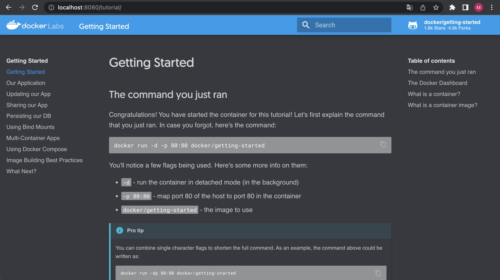

## Docker desktop의 유료화

대부분의 사용자들이 Container를 접하는 것은 Docker를 통해서 접하고 있을 것입니다.
Linux distribution(e.g. Ubuntu, CentOS, ...)을 사용하는 User는 문제가 없지만 Windows나 MacOS에서는 Docker를 그대로 사용할 수 없고, 가상화를 통해서만 사용이 가능합니다.
이러한 사용자들의 불편함을 줄여주기 위해 등장한 것이 바로 Docker desktop입니다.
Docker desktop은 [LinuxKit](https://github.com/linuxkit/linuxkit)을 이용하여 Docker를 사용할 수 있는 Virtual Machine을 Windows나 MacOS에서 자동으로 구축하여 Docker를 사용할 수 있는 환경을 만들어 줍니다.
이러한 Docker desktop이 Business 목적으로 사용될 경우 유료로 전환되었습니다.
2022.01.31이 지난 이후로는 Business 목적으로 사용할 경우 Docker에 구독 형식으로 사용료를 지불해야 합니다.
이러한 변화는 기존의 Docker desktop을 무료로 사용하던 유저들에게는 부담될 수 밖에 없습니다.
Docker desktop의 대체제를 찾던 도중 [podman](https://github.com/containers/podman)을 발견하게 되었습니다.

## Podman?

[Podman](https://github.com/containers/podman)은 Docker CLI에서 사용되는 대부분의 command가 호환되는 conatiner/pod을 관리할 수 있는 tool입니다.
심지어 [Podman 문서](https://docs.podman.io/en/latest/index.html)에서는 `alias docker=podman`으로 alias를 걸어서 사용해도 무방하다고 얘기하고 있을 정도로 Docker CLI와 대부분 호환이 가능합니다.
그럼 실제로 podman을 설치하고 사용해보도록 하겠습니다.

## Environment

이번 post에서 사용된 local 환경은 아래외 같습니다.
```text
Machine: Macbook Pro (16-inchim, 2021), Apple M1 Pro
OS: MacOS Monterey 12.1
```

## Install Podman

Mac에서는 [homebrew](https://brew.sh/index_ko)를 이용해서 간단하게 설치 가능합니다.

```shell
brew install podman
```

위 명령어로 설치한 뒤에, `version` command를 이용해서 설치된 Podman의 버전을 확인할 수 있습니다.

```shell
$ podman version
Client:
Version:      3.4.4
API Version:  3.4.4
Go Version:   go1.17.6
Built:        Thu Dec  9 03:41:11 2021
OS/Arch:      darwin/arm64

Server:
Version:      3.4.4
API Version:  3.4.4
Go Version:   go1.16.8
Built:        Thu Dec  9 06:48:10 2021
OS/Arch:      linux/arm64
```

제가 설치할 때는 `3.4.4`가 최신버전이라 `3.4.4`로 설치되었습니다.

## Podman machine

Windows나 MacOS에서는 container를 바로 구동시킬 수 없어서 container를 구동시킬 수 있는 Virtaul Machine을 만들어서 해당 Virtual Machine을 만들어서 이 위에 container를 올리는 방식을 주로 사용합니다.
Podman에서는 Windows나 MacOS에서도 쉽게 container를 사용할 수 있도록 [machine](https://docs.podman.io/en/latest/markdown/podman-machine.1.html)아리는 command를 사용해서 Virtual Machine을 쉽게 만들고, 관리할 수 있도록 제공하고 있습니다.

### Virtual Machine 생성하기

[machine init](https://docs.podman.io/en/latest/markdown/podman-machine-init.1.html)을 통해서 Virtual Machine의 생성이 가능합니다.

```shell
podman machine init \
  --cpus 2 \
  --memory 4096 \
  --disk-size 32 \
  --image-path stable \
  default-vm
```

위 처럼 cpu 2core, memory 4GB, disk 32GB의 `default-vm`이란 이름의 Podman machine을 생성했습니다.

```shell
$ podman machine list
NAME         VM TYPE     CREATED         LAST UP         CPUS        MEMORY      DISK SIZE
default-vm*  qemu        12 seconds ago  12 seconds ago  2           4.295GB     34.36GB
```

[machine list](https://docs.podman.io/en/latest/markdown/podman-machine-list.1.html) 명령어를 통해서 생성된 machine을 확인 가능합니다.

### Virtual Machine 구동시키기

[machine start](https://docs.podman.io/en/latest/markdown/podman-machine-start.1.html) 명령어를 통해서 생성된 machine의 구동이 가능합니다.

```shell
$ podman machine start default-vm
INFO[0000] waiting for clients...
INFO[0000] listening tcp://127.0.0.1:7777
INFO[0000] new connection from  to /var/folders/v5/4w4brkd5593764fjm96sjzpc0000gn/T/podman/qemu_default-vm.sock
Waiting for VM ...
Machine "default-vm" started successfully
```

그리고 구동되어 있는지 `machine list`로 확인해봅시다.

```shell
$ podman machine list
NAME         VM TYPE     CREATED        LAST UP            CPUS        MEMORY      DISK SIZE
default-vm*  qemu        6 minutes ago  Currently running  2           4.295GB     34.36GB
```

`LAST UP` 부분을 보시면 `Currently running`이 뜨는 것을 보실 수 있습니다.

## Contianer 생성하기

이제, container가 올라갈 Virtual Machine도 생성되었으니, 해당 machine에 container를 생성해보겠습니다.
docker에서 제공하는 [getting started](https://docs.docker.com/get-started/)에서 제공하는 container image를 이용해서 생성해 보겠습니다.
위 자료에서 제공하는 명령어를 docker에서 podman으로만 변경해서 진행하면 됩니다.

```shell
# Create container using docker/getting-started image
$ podman run -d -p 8080:80 docker/getting-started
798b8a5a02819ff3a0c942879ae21348a1343bd14741b27edb6422d5db3216b7

# Listing containers
$ podman ps
CONTAINER ID  IMAGE                                    COMMAND               CREATED        STATUS             PORTS                 NAMES
798b8a5a0281  docker.io/docker/getting-started:latest  nginx -g daemon o...  9 seconds ago  Up 10 seconds ago  0.0.0.0:8080->80/tcp  beautiful_northcutt
```

local의 8080 port로 접근하면 container의 80 port로 접근할 수 있게 설정해주었습니다.
그런 뒤, chrome에서 http://localhost:8080로 접속할 경우 아래와 같이 docker의 getting-started page를 확인하실 수 있습니다.



## 결론

Podman을 통해서 docker desktop을 대체 가능할 수 있었고, machine이라는 command 제공을 통해서 Virtual Machine의 제어가 가능한 점이 좋았습니다.
Docker desktop이 필요하다면 podman을 대신해서 사용하는 것도 괜찮을 것 같습니다.
