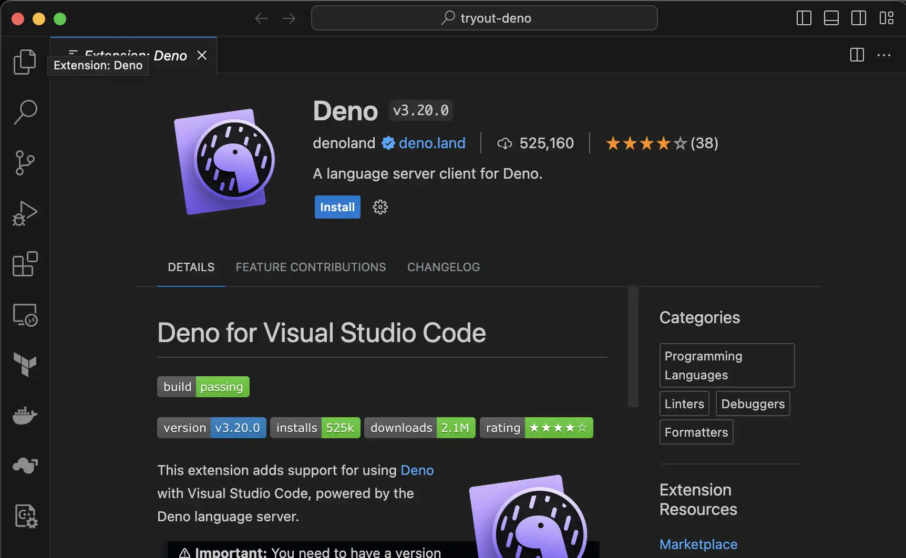

Deno runtime의 경우 V8, Rust, Tokio로 만들어진 Javascript, Typescript, WebAssembly Runtime입니다. 이번에는 간단한 예제를 확인해보고 nodejs와 어떻게 다른지 한 번 확인해보는 시간을 가져보도록 하겠습니다.

## Environment

이번 post에서 사용된 local 환경은 아래외 같습니다.

```text
Machine: Macbook Pro (16-inchim, 2021), Apple M1 Pro
OS: MacOS Monterey 12.6.3
```

## Deno 설치

[Deno installation](https://deno.land/manual@v1.36.3/getting_started/installation)를 참고하면 아래 command로 간단하게 설치가 가능합니다.

```sh
curl -fsSL https://deno.land/x/install/install.sh | sh
```

deno binary가 자동으로 설치되고, 아래 명령어를 통해서 deno binary를 PATH에 등록해줍니다.

```sh
cat <<EOF >>$HOME/.zshrc
# Deno
export DENO_INSTALL="/Users/user/.deno"
export PATH="\$DENO_INSTALL/bin:\$PATH"
EOF
source $HOME/.zshrc
```

## Deno binary 설치 확인

```sh
$ deno --version
deno 1.36.3 (release, aarch64-apple-darwin)
v8 11.6.189.12
typescript 5.1.6
```

## Deno vscode plugin 설치

vscode를 IDE로 사용하는 개발자들을 위해서 [deno plugin](https://marketplace.visualstudio.com/items?itemName=denoland.vscode-deno)을 제공하고 있습니다. `install` 버튼을 눌러서 설치해줍니다.



그리고 vscode의 deno관련 workspace에서 deno plugin을 enable하기 위해서 아래 파일을 생성해줍니다. (기존에 파일이 있다면 json에 해당 key/value들을 추가해줍니다.)

```json
# path: .vscode/settings.json
{
  "deno.enable": true,
  "deno.lint": true,
  "editor.formatOnSave": true,
  "[typescript]": { "editor.defaultFormatter": "denoland.vscode-deno" }
}
```

## Hello, World 예제 실행

아래처럼 `tryout-deno.ts` typescript file을 만들어서 아래 code를 복사해서 넣어줍니다.

```typescript
# tryout-deno.ts
console.log('Hello, World!')
```

위 코드는 아래처럼 동작시키면 `Hello, World!`가 나오게 됩니다. typescript 관련 library 등을 설치할 필요 없이 deno binary에서 지원합니다..

```sh
$ deno run tryout-deno.ts 
Hello, World!
```

## deno project 생성

deno binary를 이용해서 deno의 sample code를 생성하고 생성된 file들에 대한 간단한 설명을 드리겠습니다. 아래 명령어를 입력해주시면 간단하게 생성이 가능합니다.

```sh
deno init
```

그러면 아래처럼 4가지 파일이 생성되게 됩니다.

```sh
$ tree
.
├── deno.jsonc
├── main.ts
├── main_bench.ts
└── main_test.ts

1 directory, 4 files
```

1. deno.jsonc: `package.json`처럼 deno의 설정 파일입니다. 자세한 내용은 [이쪽](https://deno.land/manual@v1.36.4/getting_started/configuration_file)을 참고해주세요.
2. main.ts: 자동 생성된 예제에서는 간단한 add 함수와 예제가 있습니다. 위 `deno.jsonc`의 task에서 해당 `main.ts`를 수행할 수 있는 `dev` task가 예제로 명시되어 있습니다.
3. main_bench.ts: deno에서는 `deno bench`를 통해서 [benchmark를 할 수 있는 API와 tool](https://deno.land/manual@v1.36.4/tools/benchmarker)을 제공하고 있습니다. 현 예제에서는 `main.ts`의 add 함수에 대한 benchmark 예제가 있습니다.
4. main_test.ts: deno에서는 `deno test`를 통해서 [test를 위한 API와 tool](https://deno.land/manual@v1.36.4/basics/testing#testing)을 제공하고 있습니다. 현 예제애서는 `main.ts`의 add 함수에 대한 test 예제가 있습니다.

## Conclusion

deno binary를 설치하고 간단한 sample code를 생성한 뒤, 생성된 파일들에 대해서 간단히 살펴보았습니다. 기존 node보다 typescript를 기본적으로 지원하고, package도 따로 설치하지 않고도 code에 직접 명시할 수 있는 것이 색다르다고 느겼습니다. 다음엔 deno를 이용해서 backend server를 작성해보도록 하겠습니다.
